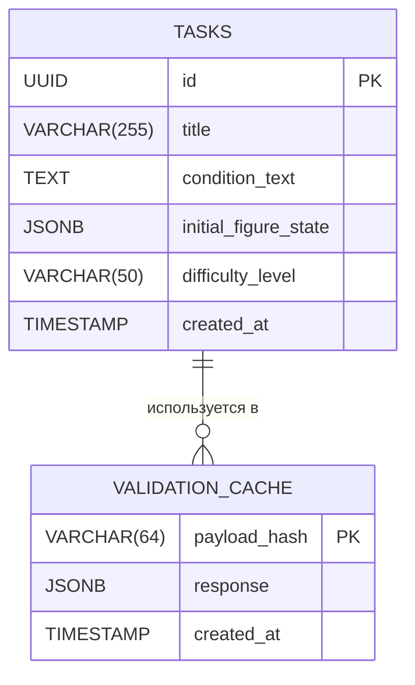

# Проектирование базы данных: Стереометрия (MVP)

## 1. Анализ предметной области
Приложение работает с **задачами по стереометрии**. Ученик видит условие и начальную фигуру.
В MVP отсутствует аутентификация, сессии хранятся в `localStorage`. Следовательно, на бэкенде нам нужно хранить только **статические данные** (задачи) и, возможно, кэш валидации.

## 2. ER-диаграмма (Упрощенная)



## 3. Детальное описание сущностей

### 3.1. TASKS (Задачи)
Основная сущность. Хранит условие задачи, начальное состояние 3D-фигуры, а также **эталонные** построение и доказательство.

| Столбец | Тип | Nullable | Описание |
| :--- | :--- | :--- | :--- |
| **id** | `UUID` | NOT NULL | Первичный ключ (PK). Генерируется `gen_random_uuid()`. |
| **title** | `VARCHAR(255)` | NOT NULL | Краткое название задачи (для списка). |
| **condition_text** | `TEXT` | NOT NULL | Полный текст условия задачи (по Атанасяну). |
| **initial_figure_state** | `JSONB` | NOT NULL | Состояние фигуры **до** начала решения (точки, ребра). |
| **reference_figure_state** | `JSONB` | NULL | Эталонное состояние фигуры **после** полного решения (содержит все построенные точки/плоскости). Если NULL — LLM работает без эталона. |
| **reference_proof** | `JSONB` | NULL | Массив шагов доказательства (эталон). Используется LLM для сравнения. Если NULL — LLM анализирует только на основе аксиом. |
| **difficulty_level** | `VARCHAR(50)` | DEFAULT | Уровень сложности (напр. "10 класс"). |
| **created_at** | `TIMESTAMP` | DEFAULT | Время создания записи. |

**Логика использования эталонов:**
1. Если `reference_figure_state` и `reference_proof` заполнены, Backend подает их в контекст LLM. Модель сравнивает ход ученика с эталоном.
2. Если поля пусты (NULL), LLM выполняет проверку, опираясь только на аксиомы и текущее состояние фигуры (более сложный режим).

#### Структура поля `reference_proof` (JSONB)
Эталонное доказательство разбито на шаги, аналогично тому, как ученик будет вводить свое:
```json
[
  {
    "step_id": 1,
    "claim": "Проведем в грани ABCD диагональ AC.",
    "justification_id": "construction",
    "comment": "AC лежит в основании"
  },
  {
    "step_id": 2,
    "claim": "Треугольник ABC равнобедренный.",
    "justification_id": "theorem_5.1",
    "comment": "По условию AB=BC"
  }
]
```

#### Структура поля `initial_figure_state` (JSONB)
Это критически важный объект, который фронтенд будет парсить для отрисовки JSXGraph:
```json
{
  "vertices": [
    { "id": "A", "x": 1.0, "y": 1.0, "z": 0.0 }
  ],
  "edges": [
    { "from": "A", "to": "B", "relation": "ребро" }
  ],
  "relations": ["ABCD - квадрат"],
  "actions_log": []
}
```

### 3.2. VALIDATION_CACHE (Кэш валидации)
Реализуем кэш прямо в БД (или в памяти, но для надежности MVP лучше в БД), чтобы не дергать LLM повторно при одинаковых запросах.

| Столбец | Тип | Описание |
| :--- | :--- | :--- |
| **payload_hash** | `VARCHAR(64)` | **PK**. SHA-256 хэш от тела запроса (task_id + proof_history + current_step). |
| **response** | `JSONB` | Сохраненный ответ от LLM (валидный JSON). |
| **created_at** | `TIMESTAMP` | Время создания записи для TTL (Time To Live). |

*Примечание: Для MVP в рамках требований уместнее использовать `lru_cache` в Python, но если требуется персистентность между перезапусками бэкенда, таблица необходима.*

## 4. Определение связей
В MVP связи минимальны:
- **TASKS -> VALIDATION_CACHE**: Один-ко-многим (опционально). Хэш запроса уникален, но в нем зашит `task_id`. В MVP можно обойтись без явного Foreign Key на кэш ради производительности, либо добавить `task_id` в таблицу кэша.

## 5. Стратегия миграций (Liquibase)
Поскольку у нас Liquibase, скрипты должны быть идемпотентными (безопасными для повторного запуска).

**Changelog 001: Создание таблиц**
1. `CREATE TABLE IF NOT EXISTS tasks ...`
2. `CREATE INDEX IF NOT EXISTS ...`
3. `INSERT ... ON CONFLICT DO NOTHING` (для примеров данных).

## 6. Особенности для LLM-валидации
База данных **не хранит**:
1. Сами доказательства (они в `localStorage`).
2. Состояние фигуры в процессе решения (оно в `localStorage`).

База данных **хранит**:
1. Точку отсчета (Условие + Начальная фигура).
2. (Опционально) Результаты проверки для экономии ресурсов LLM.

## 7. Итоговая SQL-схема (Liquibase)

```sql
-- liquibase/changelogs/001-init-tasks.sql

-- Таблица задач
CREATE TABLE IF NOT EXISTS tasks (
    id UUID PRIMARY KEY DEFAULT gen_random_uuid(),
    title VARCHAR(255) NOT NULL,
    condition_text TEXT NOT NULL,
    initial_figure_state JSONB NOT NULL,
    difficulty_level VARCHAR(50) DEFAULT '10-11 класс',
    created_at TIMESTAMP WITH TIME ZONE DEFAULT NOW()
);

-- Индекс для поиска по сложности
CREATE INDEX IF NOT EXISTS idx_tasks_difficulty ON tasks(difficulty_level);

-- Таблица кэша (опционально для MVP, но полезно)
CREATE TABLE IF NOT EXISTS validation_cache (
    payload_hash VARCHAR(64) PRIMARY KEY,
    response JSONB NOT NULL,
    created_at TIMESTAMP WITH TIME ZONE DEFAULT NOW()
);

-- Пример данных (Upsert паттерн)
INSERT INTO tasks (title, condition_text, initial_figure_state)
VALUES (
    'Пересечение диагоналей граней',
    'В прямоугольном параллелепипеде ABCDA1B1C1D1 докажите, что диагонали граней, исходящие из одной вершины, пересекаются в одной точке.',
    '{
        "vertices": [
            {"id": "A", "x": 1, "y": 1, "z": 0},
            {"id": "B", "x": 4, "y": 1, "z": 0},
            {"id": "D", "x": 1, "y": 3, "z": 0},
            {"id": "A1", "x": 1.5, "y": 1.5, "z": 3}
        ],
        "edges": [
            {"from": "A", "to": "B"},
            {"from": "A", "to": "D"},
            {"from": "A", "to": "A1"}
        ],
        "relations": ["A - начальная точка"],
        "actions_log": []
    }'::jsonb
)
ON CONFLICT (id) DO NOTHING; -- Если используем ID по умолчанию, замените на уникальное поле или убирайте ON CONFLICT
```

## 8. Резюме по проектированию
1. **Минимализм**: Только таблица `tasks` необходима для старта.
2. **JSONB**: Выбран для `initial_figure_state`, так как структура фигуры гибкая и специфична для JS-клиента.
3. **Кэш**: Выделен в отдельную таблицу, чтобы не засорять `tasks`.
4. **Отсутствие User-таблиц**: Строгое соблюдение ТЗ (анонимность).
