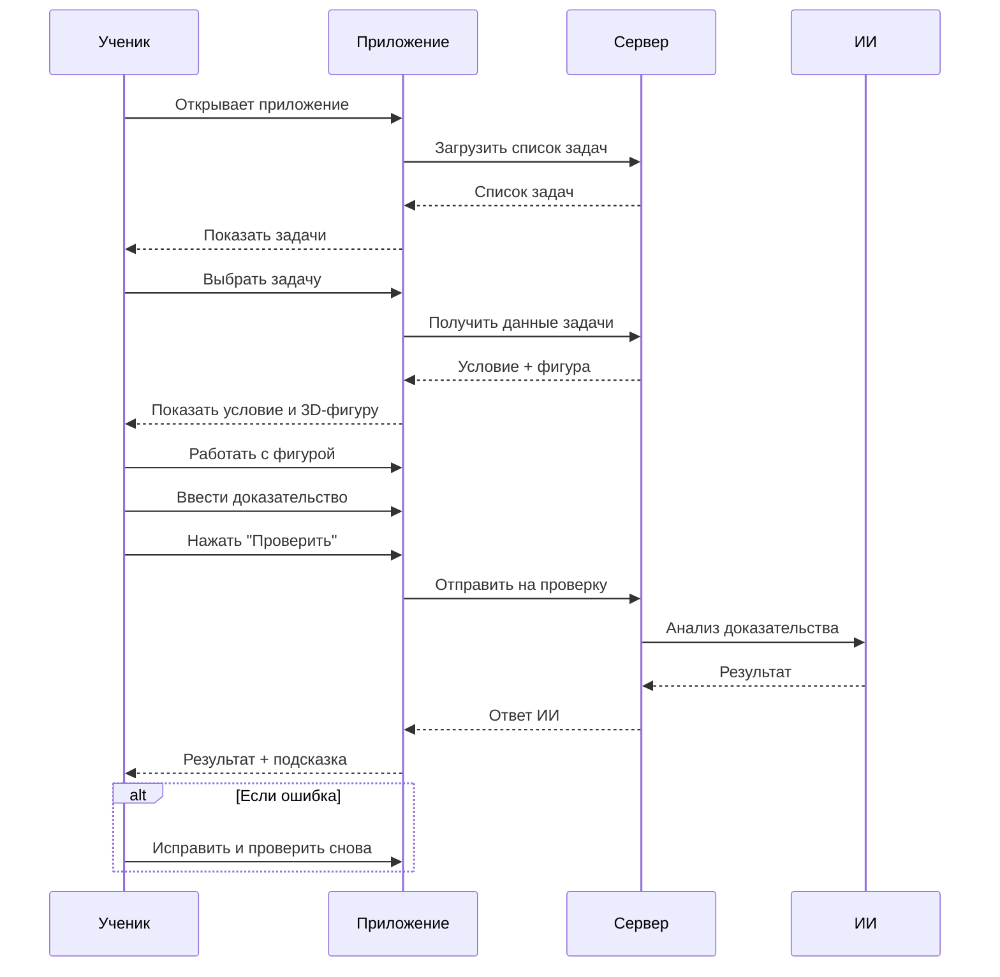

# Диаграмма последовательности: Основной бизнес-процесс

## Описание

Приложение для проверки геометрических доказательств (стереометрия) с 3D-визуализацией и ИИ-валидацией.

## Диаграмма

## Этапы процесса

1. **Выбор задачи** — ученик видит список задач с фильтрами
2. **Работа** — интерактивная 3D-фигура + ввод доказательства
3. **Проверка** — ИИ анализирует каждый шаг
4. **Обратная связь** — результат + наводящая подсказка
5. **Итерация** — повтор до правильного решения
